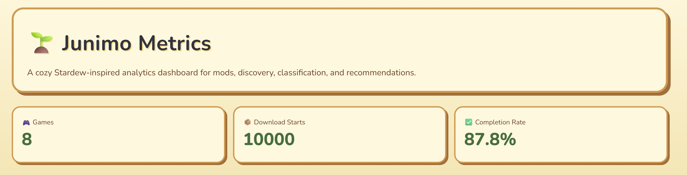

# JunimoMetrics

A cute, cosy analytics engineering and machine learning MVP for behavioural, creator, lifecycle, classification, recommendation, and download analytics of games MODS.



JunimoMetrics is an analytics engineering and ML showcase that turns synthetic product event data into governed metrics, lifecycle audiences, predictive mod classification outputs, recommendation tables, discovery scoring, and stakeholder-ready dashboards.

## Why this project matters

JunimoMetrics demonstrates how analytics engineering and machine learning can work together in a product analytics workflow.

Instead of keeping ML in a notebook, the project writes model outputs back into the warehouse and exposes them through dashboard-ready tables. This mirrors production workflows where classification, search relevance, recommendations, and lifecycle audiences power downstream tools such as personalisation platforms, marketing systems, and product dashboards.


## What it demonstrates

- Synthetic product event and mod metadata generation
- dbt staging, intermediate, and mart models
- Data quality tests
- Metric catalogue / semantic layer
- Lifecycle audience segmentation
- Streamlit dashboard for stakeholder analytics
- Local DuckDB warehouse, designed to mirror ClickHouse-style analytical modelling
- Machine learning pipeline for mod classification
- NLP-based text classification using mod names, descriptions, tags, and metadata
- Model scoring pipeline that writes predictions back into DuckDB
- Classification confidence scoring and low-confidence review queue
- Discovery quality scoring for search and filtering use cases
- Item-to-item recommendation modelling using completed download behaviour
- ML outputs surfaced directly in the dashboard for product and discovery insights


## Architecture

```text
Synthetic CSV data
→ DuckDB warehouse
→ dbt models/tests/docs
→ Python ML training and scoring scripts
→ ML prediction and recommendation tables
→ Streamlit dashboard
```

## ML and predictive features

JunimoMetrics includes a lightweight production-style ML layer designed to mirror how classification and discovery systems can be built at scale.

### Mod classification

The project trains a text classification model using synthetic mod metadata, including:

- mod name
- description
- tags
- moderation status
- dependency count
- existing category labels

The classifier predicts a structured mod category such as:

- visual
- gameplay
- UI
- quests
- performance

Predictions are written back into DuckDB as an ML output table:

```text
ml_mod_classification
```

The dashboard then surfaces:

- number of classified mods
- average classification confidence
- low-confidence mods requiring review
- predicted category distribution

### Discovery scoring

The dashboard calculates a simple discovery quality score using classification confidence and dependency count.

This demonstrates how raw ML outputs can be transformed into product-facing discovery signals for:

- search ranking
- filtering
- content quality review
- metadata enrichment
- personalisation

### Recommendations

JunimoMetrics includes an item-to-item recommendation pipeline using completed download behaviour.

The recommendation model identifies mods with similar user interaction patterns and writes them into:

```text
ml_mod_recommendations
```

The dashboard surfaces the recommendation table and similarity score distribution.

## Business questions answered

1. Which games drive the most download activity?
2. Which games have the strongest download completion rate?
3. Which users fall into lifecycle audiences?
4. Which metrics are governed in the metric catalogue?
5. How many mods have been classified by the ML model?
6. Which predicted mod categories are most common?
7. Which mods have low classification confidence and need review?
8. Which categories have the strongest discovery quality?
9. Which mods should be recommended together based on user download behaviour?
10. How can ML outputs support search, filtering, and personalisation?


## Setup

```bash
python -m venv .venv
source .venv/bin/activate

pip install dbt-duckdb duckdb pandas faker streamlit plotly scikit-learn joblib

python scripts/generate_data.py

cd mods_analytics
dbt seed
dbt run
dbt test
dbt docs generate

cd ..

python ml/train_mod_classifier.py
python ml/score_mods.py
python ml/recommend_mods.py

cd dashboard
streamlit run app.py
```

## ML scripts

Train the mod classification model:

```bash
python ml/train_mod_classifier.py
```

Score all mods and write predictions to DuckDB:

```bash
python ml/score_mods.py
```

Build item-to-item mod recommendations:

```bash
python ml/recommend_mods.py
```

## Dashboard features

The Streamlit dashboard includes:

- cozy Stardew-inspired UI styling
- game growth metrics
- download completion analytics
- lifecycle audience segmentation
- metric catalogue
- ML mod classification summary
- classification confidence monitoring
- low-confidence review queue
- discovery quality views
- discovery score ranking
- mod recommendation outputs
